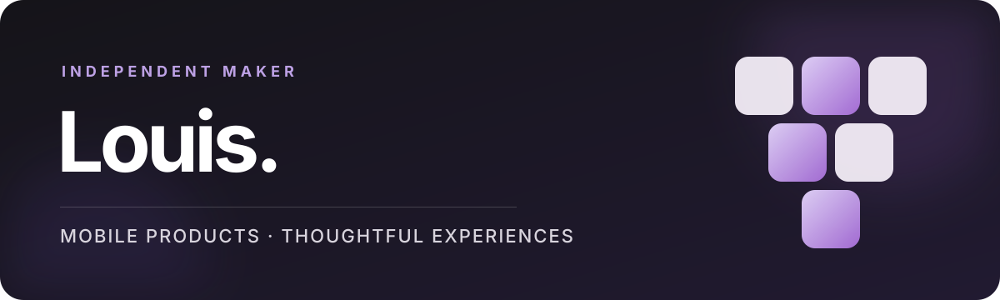

  

  <a href="README.en.md">English version</a>

  Je conçois des applications mobiles qui partent d’un problème réel 
  et deviennent des expériences simples, utiles et soignées.

## Mes créations

<table>
  <tr>
    <td width="50%" valign="top">
      <h3>Vault</h3>
      
<code>BÊTA</code> <code>iOS</code>

      
Un portefeuille mobile pour centraliser ses bons de réduction, coupons et cartes cadeaux, les organiser et recevoir un rappel avant leur expiration.

      
<a href="https://github.com/lsaillen-ui/vault-showcase"><strong>Découvrir Vault →</strong></a>

    </td>
    <td width="50%" valign="top">
      <h3>VetNote</h3>
      
<code>EN DÉVELOPPEMENT</code> <code>MOBILE</code>

      
Une application conçue pour simplifier l’organisation et la prise de notes lors des interventions terrain des vétérinaires, même sans connexion réseau.

      
<a href="https://github.com/lsaillen-ui/vetnote-showcase"><strong>Découvrir VetNote →</strong></a>

    </td>
  </tr>
</table>

## Ma manière de créer

| Problème réel | Itérations courtes | Expérience claire |
| :--- | :--- | :--- |
| Comprendre l’usage avant d’imaginer les fonctionnalités. | Construire une première version, l’éprouver, puis l’améliorer. | Aller à l’essentiel et respecter le contexte de l’utilisateur. |

Je développe rapidement, tout en gardant une frontière nette entre ce qui peut être montré et ce qui doit rester privé.

---

  Une question ou une idée ? 
  <a href="mailto:koveo.agency@gmail.com"><strong>koveo.agency@gmail.com</strong></a>

